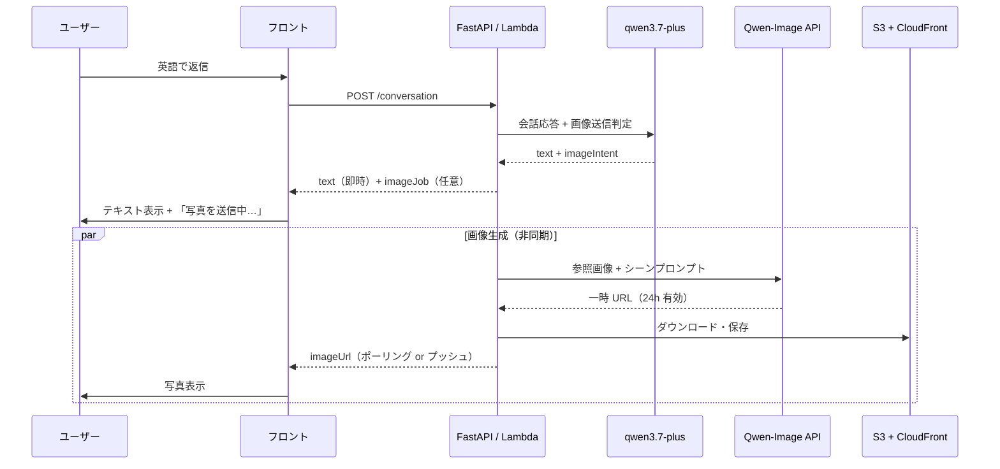

# キャラクター画像・AI 画像生成 設計方針

**ステータス**: Phase 2 実装済み（管理者画面・local develop のみ） / 会話中画像は未実装  
**最終更新**: 2026-06-27

## 概要

バディトークの差別化ポイントとして、**会話の流れに合ったリアルタイム AI 画像生成**を導入する。会話相手（Lisa スロットの 6 キャラ）が SNS DM のように、文脈に沿った写真を送ってくる体験を実現する。

本ドキュメントは、以下 3 層を一体として設計する。

1. **参照ポートレート** — 各キャラの「同一人物感」を担保するマスター画像（初回生成・反復調整）
2. **会話中のリアルタイム画像** — ユーザーとの会話に応じて API で都度生成
3. **管理者用画像作成画面** — 参照ポートレートの探索・修正・採用を行う内部ツール

---

## 基本方針

| 項目 | 方針 |
|------|------|
| サービスの核 | 「今の会話に合った、あの人からの写真が届く」体験 |
| AI プロバイダ | Alibaba Cloud DashScope（Singapore）。テキストは既存の `qwen3.7-plus`、画像は Qwen-Image / Image Edit 系 |
| 事前用意カタログ | **採用しない**（会話写真はリアルタイム生成が前提） |
| 参照画像 | 各キャラ **1 枚** のマスターポートレートは事前に用意（顔の一貫性のため） |
| 本番会話画面 | テキスト応答は即時、画像は非同期で後から届く |
| 管理者画面 | 会話画面とは **別ルート・別 UI**（本番ユーザーには公開しない） |

---

## 画像の 2 層構造

### 層 1: 参照ポートレート（静的アンカー）

- **目的**: キャラの顔・雰囲気を固定し、会話中に生成する写真の「同一人物感」を担保する
- **数**: Lisa タイプ 6 種 × 1 枚（`reference.png`）
- **生成方法**: 初回は text-to-image で候補を量産し、image-edit でストレステストを通過した 1 枚を採用
- **用途**:
  - 選択画面・会話パネルのアバター表示
  - 会話中のセルフィー系写真生成時の参照入力（image-edit）

### 層 2: 会話中のリアルタイム画像（動的）

- **目的**: 会話の文脈に合った写真をその都度生成する（サービスの核）
- **生成タイミング**: Lisa が英語返答を送るタイミングで、条件を満たす場合に非同期生成
- **種類**:
  - `selfie` 等（キャラ入り）→ 参照ポートレート + image-edit
  - `scene` / `food` / `pet` 等（顔なし）→ text-to-image のみ

---

## アーキテクチャ

### 2 段パイプライン（会話 LLM と画像 LLM の分離）

テキスト生成と画像生成は **別処理** とする。同一 HTTP リクエストで同期完結させない。



### 分離する理由

| 課題 | 対策 |
|------|------|
| 画像生成に 10〜30 秒かかる | テキストを先に返し、画像は後追い |
| Lambda / API Gateway のタイムアウト（約 29 秒） | 画像ジョブを非同期化 |
| 会話プロンプトと画像プロンプトの要件が異なる | 専用の画像プロンプトビルダーを API 側に置く |
| DashScope の生成 URL は **24 時間で失効** | 生成後すぐ S3 に保存し、CloudFront URL を返す |

---

## 利用する DashScope モデル

リージョンは既存構成と同じ **Singapore**（`dashscope-intl.aliyuncs.com`）。認証は `DASHSCOPE_API_KEY`。

| 用途 | モデル（候補） | 備考 |
|------|----------------|------|
| 参照ポートレートの候補量産 | `qwen-image-2.0-pro` / `qwen-image-max` | 顔の品質重視 |
| 参照ポートレートのストレステスト・会話中セルフィー | `qwen-image-edit-max` | character consistency 向き |
| 風景・食べ物・ペットのみ | `qwen-image-2.0` 等 | text-to-image、参照画像不要 |
| 速度優先の実験 | `wan2.2-t2i-flash` 等 | 品質は落ちるが試行錯誤向き |

**ルール**: 参照画像の作り方と会話中写真の作り方で、可能な限り同系統のモデルを使い、品質ギャップを抑える。

---

## 会話フロー設計

### Step 1: 会話 LLM（`qwen3.7-plus`）が送信判定

`LISA_RULES`（既存）に加え、画像送信に関するルールを将来追加する。

- SNS DM シナリオなので、たまに写真を送ってよい（目安: 5 ターンに 1 回程度）
- ユーザーが "send me a photo" 等と言った場合は送る
- 出力は構造化（JSON またはマーカー形式）

**出力例（JSON）**:

```json
{
  "text": "Here's me at my favorite cafe!",
  "image": {
    "send": true,
    "kind": "selfie",
    "scene": "cozy cafe with latte, casual smile"
  }
}
```

**`kind` の想定値**:

| kind | 生成方式 |
|------|----------|
| `selfie` | 参照ポートレート + image-edit |
| `scene` | text-to-image |
| `food` | text-to-image |
| `pet` | text-to-image |

マーカー方式（`<<photo:...>>`）もフォールバック候補だが、パース失敗時の扱いを決めておくこと。

### Step 2: 画像プロンプトビルダー（API 側）

会話 LLM の `scene` をそのまま画像 API に渡さない。API 側で **専用の英語プロンプト** に変換する。

- キャラごとの `visual_anchor`（外見の固定記述）を付与
- 安全制約（`fully clothed`, `tasteful`, `language learning app` 等）を付与
- Sofia（flirty）向けは会話はフリーティーでも、**画像はサーバー側で安全寄りにクランプ**

### Step 3: 生成 → S3 保存 → フロントへ配信

1. DashScope が一時 URL を返す
2. API が画像をダウンロードし S3 に保存（WebP 推奨）
3. CloudFront URL をフロントに返す

---

## API 契約（予定・未実装）

### 既存 `POST /conversation` の拡張

```typescript
type ConversationResponse = {
  text: string;
  usage: ApiUsage;
  imageJob?: {
    id: string;
    status: 'pending';
  };
};
```

### 新規: 画像ジョブ取得

```typescript
// GET /conversation/image-jobs/{jobId}
{
  status: 'pending' | 'ready' | 'failed';
  imageUrl?: string;  // CloudFront URL
  error?: string;
}
```

### メッセージ型の拡張（フロント）

```typescript
type MessageAttachment = {
  type: 'image';
  url: string;
  alt?: string;
  status?: 'generating' | 'ready' | 'failed';
};

type Message = {
  // 既存フィールド
  content: string;
  attachment?: MessageAttachment;
};
```

### フロントの挙動（予定）

1. Lisa テキストを既存の `revealLisaReply` と同様に即時表示
2. `imageJob` があればポーリング（例: 2 秒間隔、最大 30 秒）
3. `ready` になったら同一 `messageId` に `attachment` をマージ
4. UI は「写真を送信中…」スケルトン → フェードイン

---

## 会話履歴・チサト・巻き戻しへの影響

### 会話履歴（LLM への再送）

画像そのものは LLM に渡さない。テキスト説明に変換する。

```text
Here's my coffee! [shared photo: cafe selfie]
```

### チサト（自動フィードバック・相談）

- 変更なし（英語テキストへのフィードバックのみ）
- 画像はチサトチャンネルには表示しない

### 巻き戻し（Lisa パネル）

- `attachment` を `Message` に含めれば、既存の `rewindLisaTo` はメッセージ単位削除のまま動作可能
- 画像付きメッセージも 1 メッセージとして扱う

---

## 参照ポートレート作成ワークフロー

参照画像は「完成品」ではなく **リアルタイム生成の金型**。良し悪しは単体プレビューではなく、**image-edit 後も同じ人に見えるか** で判断する。

### 3 段階ループ

```text
① キャラごとの「視覚仕様書」（visual_anchor）を固定
② text-to-image で候補を量産（1 キャラ 20〜50 枚）
③ ショートリストを image-edit でストレステスト → 合格 1 枚を reference.png として採用
```

### 視覚仕様書（visual_anchor）

会話用 `persona` とは別に、画像専用の固定テキストをキャラごとに 1 つ定義する。作り直すときは **1 要素ずつ** 変更する。

**例（Lisa / friendly）**:

```yaml
id: friendly
label: Lisa
visual_anchor: >
  27-year-old Indonesian woman, warm friendly smile,
  shoulder-length dark brown wavy hair, brown eyes,
  light natural makeup, casual cream knit top,
  soft daylight, approachable SNS profile photo style
must_avoid: >
  celebrity likeness, heavy glamour makeup, studio fashion shoot,
  multiple people, sunglasses covering face, age younger than 25
```

### 参照画像の技術要件

| 項目 | 推奨 |
|------|------|
| 構図 | バストアップ〜胸上、顔がはっきり |
| 角度 | 正面〜 3/4 |
| 背景 | 単色 or ぼかし |
| 人数 | 1 人のみ |
| サイズ | `1024*1024` または `768*1024` |
| 画風 | photorealistic、SNS プロフィール写真寄り |

### ストレステスト（採用前必須）

ショートリスト（2〜3 枚）に対し、以下 3 シーンで `qwen-image-edit-max` を試す。**全シーン自撮り構図**（本人が自分のスマホを arm's length で持ち、フロントカメラで自分を撮影）とする。

```text
共通: The person in Image 1 taking a selfie with their own smartphone at arm's length, front-facing camera, photographing themselves
Test A (cafe): … at a cozy cafe with a latte, natural smile
Test B (park): … in a city park, natural daylight, natural smile
Test C (home): … at home in a relaxed setting
```

**合格基準**:

- [ ] 3 シーンすべてで同一人物に見える
- [ ] 年齢感がキャラ設定と合う（Frank 68 歳、Jake 22 歳 等）
- [ ] アバター縮小（約 48px）でも識別できる
- [ ] アプリとして安全（過度にセクシーでない）
- [ ] 実在人物・有名人に似すぎていない

### アセット配置規約（予定）

```text
assets/images/
  {lisaTypeId}/
    spec.yaml              # visual_anchor（仕様の正本）
    candidates/            # 生成候補（日付_run_seed 等で命名）
    stress-test/           # ストレステスト結果
    reference.png          # 採用版（アプリが参照）
    reference.meta.json    # seed, model, prompt, adopted_at
```

**運用ルール**:

1. 採用版は常に `reference.png` 1 枚
2. 候補は削除せず残す（比較・巻き戻し用）
3. `reference.meta.json` に seed / model / prompt を記録（再現性）
4. 変更は `spec.yaml` の 1 フィールドずつ

### キャラ別の方向性ヒント

| ID | 名前 | 参照画像で押さえる印象 |
|----|------|------------------------|
| `friendly` | Lisa | 明るい笑顔、親しみやすい |
| `cool-senior` | Victoria | 落ち着き、清潔感、少し大人っぽい |
| `energetic-student` | Jake | 大学生カジュアル、無理にイケメンにしない |
| `flirty` | Sofia | 自信ある笑顔、**上品なセクシーさ**（参照は控えめ） |
| `gentle-elder` | Frank | 白髪・しわ・優しい目、**68 歳が伝わること** |
| `tsundere` | Mina | ややクール、悪意はない |

### 進行順

1. **Lisa（friendly）1 キャラ** でワークフローを固める
2. 型が決まったら残り 5 キャラに横展開
3. 6 キャラ揃ったら相互に「別人に見えないか」を一覧比較
4. 各キャラで会話写真を 2〜3 枚試し、最終ロック

---

## 管理者用：キャラクター画像作成画面

会話画面とは **別画面** として実装済み（develop / ローカル API のみ）。参照ポートレートの反復作業を GUI 化する内部ツール。

### 実装状況

| 項目 | 内容 |
|------|------|
| フロント URL | `http://localhost:5173/admin/character-images` |
| 画像セット定義 | プロンプト（`visual_anchor` 等）のみ入力。ID は自動採番（`img-0001` 形式）。キャラクター名の入力なし |
| 導線 | 設定選択画面フッター「キャラ画像作成（管理者）」 |
| 認証 | なし（将来追加予定） |
| API | `local_server.py` の `/admin/characters/*`（Lambda 未対応） |
| 画像配信 | `GET /media/images/*`（FastAPI StaticFiles） |
| 保存先 | `assets/images/{characterId}/` |

### 目的

- プロンプト入力 → 画像生成 → 修正指示 → 確認 → 採用、のループを画面で回す
- CLI / `experiments/qwen` だけでは非効率な「何度も作り直す」作業を加速する

### 画面構成（実装済み MVP）

**左ペイン（コントロール）**

- 画像セット一覧（ID 表示）・新規作成
- `visual_anchor` / `must_avoid` / `negative_prompt` 編集・保存
- seed（任意）、生成枚数（1〜4）
- 「候補を生成」（`qwen-image-2.0-pro`）
- 選択画像への「修正指示」+ 再生成（`qwen-image-edit-max`）
- ストレステスト（3 シーン一括）
- 「reference に採用」

**右ペイン（ギャラリー）**

- 候補・stress-test・reference のグリッド
- 選択画像のメタデータ（model, seed, prompt, 日時）

### API エンドポイント（実装済み）

| メソッド | パス | 用途 |
|----------|------|------|
| POST | `/admin/characters` | 新規画像セット作成（プロンプトのみ。ID 自動採番） |
| GET | `/admin/characters` | 作成済み画像セット一覧 |
| GET | `/admin/characters/{characterId}` | spec + reference + gallery |
| PUT | `/admin/characters/{characterId}/spec` | プロンプト更新 |
| POST | `/admin/characters/{characterId}/generate` | text-to-image で候補生成（`count` 1〜4） |
| POST | `/admin/characters/{characterId}/edit` | 参照画像 + 修正指示で再生成 |
| POST | `/admin/characters/{characterId}/stress-test` | 3 シーン一括テスト |
| POST | `/admin/characters/{characterId}/adopt` | `reference.png` + `reference.meta.json` 更新 |

**POST `/admin/characters` リクエスト例**:

```json
{
  "visual_anchor": "27-year-old Indonesian woman, warm friendly smile...",
  "must_avoid": "",
  "negative_prompt": "low quality, blurry face..."
}
```

**レスポンス**: `characterId` に採番結果（例: `img-0001`）が含まれる。

### アセット配置（実装済み）

```text
assets/images/
  {characterId}/
    spec.yaml
    candidates/       # 生成候補 + *.meta.json
    stress-test/      # ストレステスト結果 + *.meta.json
    reference.png     # 採用版
    reference.meta.json
```

### コード配置

- API: `api/src/character_image_studio/`
- フロント: `src/admin/CharacterImageStudio.tsx` ほか `src/admin/components/`

### `experiments/qwen` との役割分担

| 場所 | 用途 |
|------|------|
| `experiments/qwen` | 新モデル・新パラメータの技術検証 |
| 管理者用画面 | 日常のキャラビジュアル調整・採用 |

---

## インフラ（staging / product）

| 項目 | 方針 |
|------|------|
| 画像ストレージ | S3 バケット（例: `reticle-media-{env}`） |
| 配信 | CloudFront |
| 画像ジョブ状態 | DynamoDB（将来の会話永続化と合わせて `ImageJobs` テーブル） |
| Lambda | 画像生成は会話 API と **別関数** または非同期 invoke を検討 |

**ImageJobs テーブル案**:

```text
PK: jobId
属性: status, messageId, sessionId, s3Key, createdAt, error
```

セッション永続化前は、短 TTL の DynamoDB または develop 限定のインメモリでも可。

---

## 安全・コスト

### コンテンツ安全

- `negative_prompt` で明示的・不適切コンテンツを排除
- Sofia 向けは画像プロンプトをサーバー側でクランプ（会話のフリーティーさと画像の安全さは分離）
- 有名人名をプロンプトに入れない（likeness リスク）

### コスト管理

- 1 会話あたりの画像枚数上限（例: 3 枚）
- 送信クールダウン
- 管理者画面の 1 run あたり生成枚数上限
- develop 用 feature flag

---

## 実装フェーズ

| Phase | 内容 | 状態 |
|-------|------|------|
| 0 | `experiments/qwen` で画像 API スモークテスト | 任意 |
| 1 | 参照ポートレートワークフロー（spec + 量産 + stress test） | 管理者画面に統合 |
| 2 | 管理者用画像作成画面（6 キャラ） | **実装済み**（local のみ） |
| 3 | API: 会話中画像生成、S3 保存、画像ジョブ | 未実装 |
| 4 | フロント: `Message.attachment`、ポーリング、画像 UI | 未実装 |
| 5 | 会話プロンプト調整（送信頻度・安全制御） | 未実装 |
| 6 | staging デプロイ（管理者 API・メディア） | 未実装 |

---

## やらないこと（現時点）

- 会話写真の事前用意カタログ方式
- 本番会話画面へのプロンプト入力 UI の混在
- ユーザーからの写真アップロード（ストレージ・モデレーションが別スコープ）
- 参照画像なしの完全ゼロ静的（顔の一貫性が崩れるため）

---

## 実装着手時の同期対象

本機能を Reticle 本体に実装する際は、以下を **同時に** 更新する（プロジェクト運用ルール）。

1. 本ドキュメント（`docs/character-image-generation.md`）— 実装内容に合わせてステータス・詳細を更新
2. [`.cursor/rules/project.mdc`](../.cursor/rules/project.mdc)
3. Notion（Reticle ホームページ配下の該当ページ）

---

## 関連リンク

- [Alibaba Cloud Qwen Image API](https://www.alibabacloud.com/help/en/model-studio/qwen-image-api)
- [Qwen Image Edit API](https://www.alibabacloud.com/help/en/model-studio/qwen-image-edit-api)
- [experiments/qwen/README.md](../experiments/qwen/README.md) — 既存 Qwen チャット検証環境
